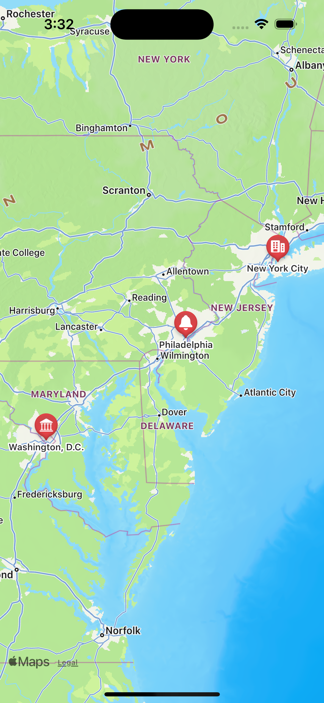

# MapKit for LiveView Native SwiftUI

`liveview-native-swiftui-mapkit` is an add-on library for [LiveView Native](https://github.com/liveview-native/live_view_native). It adds [MapKit](https://developer.apple.com/documentation/mapkit) support for displaying interactive maps.

## Installation

1. In Xcode, select *File → Add Packages...*
2. Enter the package URL `https://github.com/liveview-native/liveview-native-swiftui-mapkit`
3. Select *Add Package*

## Usage

Import `LiveViewNativeMapKit` and add the `MapKitRegistry` to the list of addons on your `LiveView`:

```swift
import SwiftUI
import LiveViewNative
import LiveViewNativeMapKit

struct ContentView: View {
    var body: some View {
        #LiveView(
            .localhost,
            addons: [MapKitRegistry<_>.self]
        )
    }
}
```

Now you can use the `Map` element in your template.

<table>

<tr>
<td>

```heex
<Map>
  <Marker
    :for={place <- @places}
    latitude={place.latitude}
    longitude={place.longitude}
    system-image={place.icon}
  >
    <%= name %>
  </Marker>
</Map>
```

</td>

<td>

</td>

</tr>

</table>

## Learn more

You can view documentation on the elements and attributes in this addon from Xcode:

1. In Xcode, select *Product → Build Documentation* in the menu bar
2. Select *Window → Developer Documentation* (Xcode should open this for you after the documentation is built)
3. Select *LiveViewNativeMapKit* in the sidebar